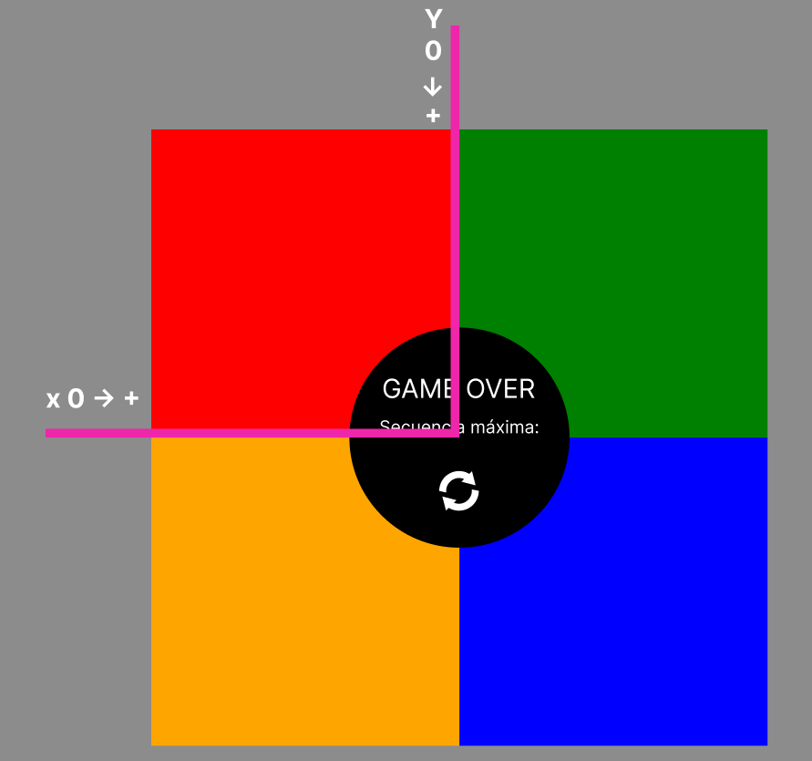
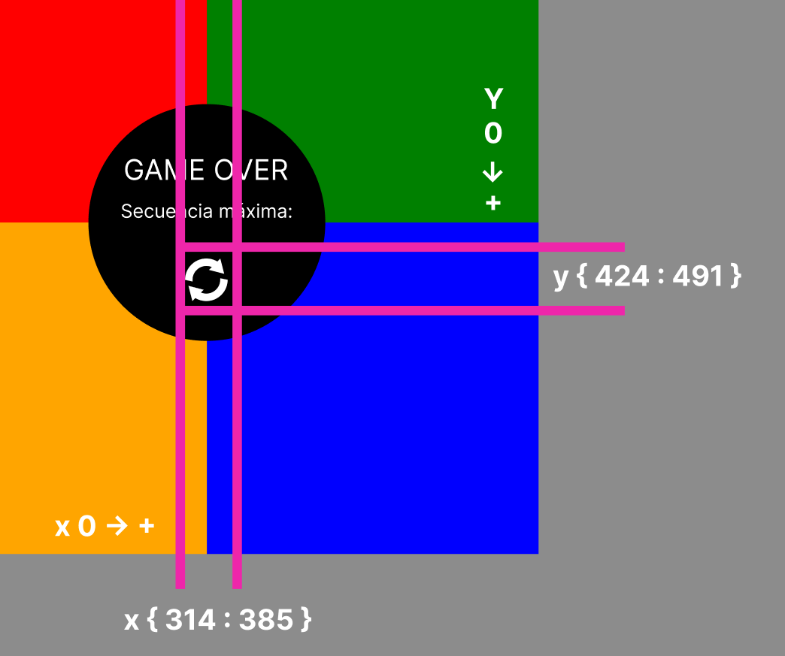
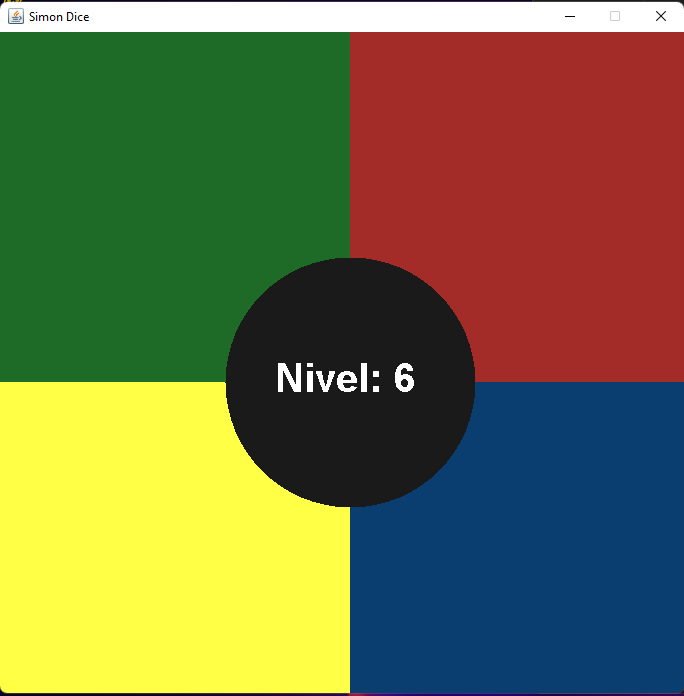
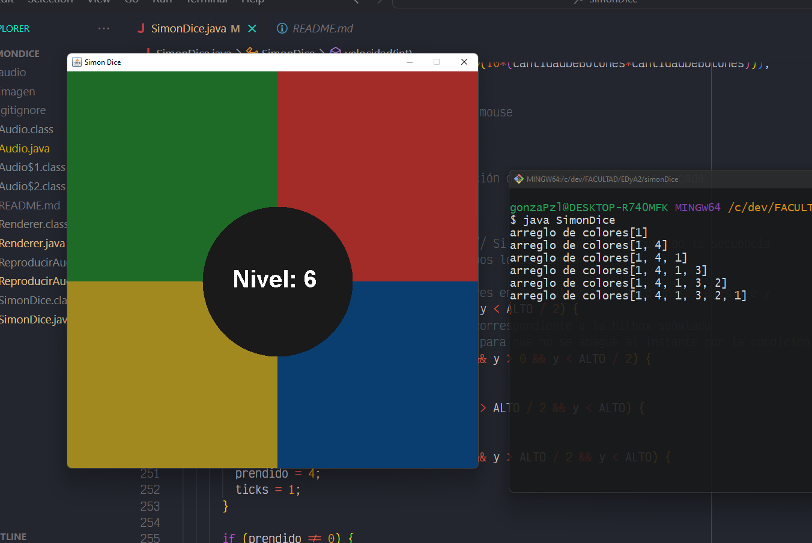
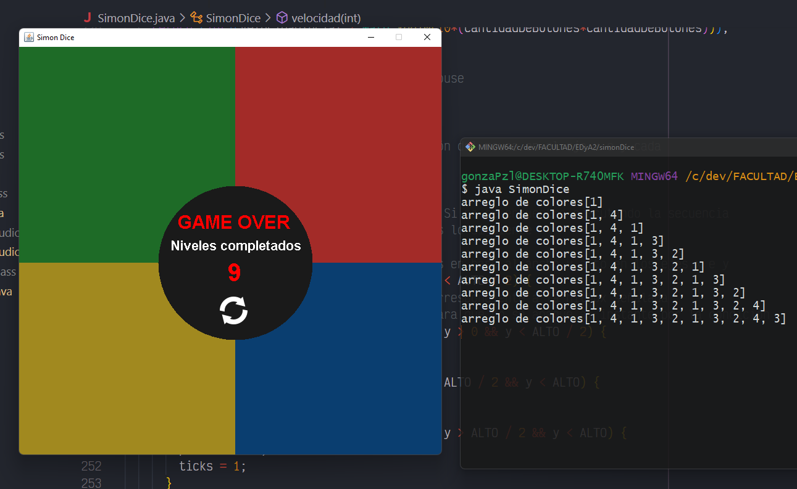

# SimonDice

Tiempo está determinado por la cantidad de veces que se ejecuta el timer, que recibe 2 parámetros, los milisegundos en los que se debe ejecutar y el objeto sobre el que aplica el lisener

### Compilado y ejecución

```bash
javac SimonDice.java
```

```bash
java SimonDice
```

# Reseña

Para realizar el juego la métodologia base es un ArrayList que se va rellenando con números randoms(Math.random) y luego el usuario deberá ir acertando en la hitbox (el espacio asignado para cada color) de cada color para poder cumplir el nivel.

Es importante destacar que un booleano nos indicará si se está ejecutando la secuencia para visualizar lo que debemos seguir o si nosotros debemos ingresar la secuencia para poder jugar.

Para poder saber en que parte de la secuencia nos encontramos tendremos un `indexSecuencia`, esta variable irá aumentando a medida que se ejecute la secuencia de visualización y a medida que nosotros acertemos la secuencia dentro del arreglo de números randoms.

### **velocidad de la secuencia**

Para la ejecución en bucle del juego vamos a utilizar los ticks, estos mismos también denominados tickrates marcan el ritmo del juego e indican al programa el renderizado de la imagen, es decir un tick es igual a una ejecución de renderizado en la ventana. Para el renderizado también utilizamos el Timer perteneciente a la libreria de swing, el timer recibe 2 parámetros, el delay y lo que debe renderizar. En el caso del delay le indicaremos cada cuantos milisegundos debería renderizar, para una mayor fluidez le diremos que 1, y que debe renderizar pasandole `this` que en este contexto hace referencia a la misma clase de SimonDice.

Aumentaremos los ticks contantemente y cuando estos sean 0 o sean iguales a la `velocidad` encenderemos la luz por ese lapso para apagarla nuevamente.

Para determinar la velocidad a la que se debe ejecutar la luz utilizamos la función `velocidad`

```java
public int velocidad(int cantidadDeBotones) {
    double velocidadIncial = 100;
    
    return (int)(velocidadIncial / Math.log10(10*(cantidadDeBotones*cantidadDeBotones)));
  }
```

Esta recibe la cantidad de botones de la secuencia, es decir le pasaremos el tamaño del arraylist y en base a una velocidadInicial devolveremos el resultado de la formula $**1/(LOG10(10*N^2))$** 

Luego esta velocidad será reasignada a la variable correspondiente cuando se el color que ingresemos sea igual al último del arreglo. (Aumentando al dificultad del nivel).

### Calculo de hitbox

Para medir las hitbox de los cuadrados correspondientes a los colores se dividio el ancho por 2 y al alto por 2



Teneindo en cuenta los lados para los que aumenta la x e y también se pudo calcular la hitbox del botón de repetir marcando como inicio la mitad (ANACHO /2)(ALTO / 2) y sumando a los mismos el ancho y alto de los píxeles de la imagen.



## Imagenes de la ejecución








# Lineamientos
Se pide construir una versión Java del juego Simon que corra bajo Windows con las siguientes consideraciones:

Interfaz Gráfica
El programa debe emplear algún tipo de interfaz gráfica, que muestre botones presionables por el usuario y que “se iluminen” (o “se destaquen” de algún modo) cada vez que se activan. Estos botones no necesariamente deben tener forma de corona circular, pudiendo ser rectangulares.

Velocidad creciente
Al iniciarse el juego, el programa mantendrá “iluminado” el primer botón de la secuencia por un segundo. A partir de allí, el tiempo durante el que se “ilumina” cada botón de la secuencia generada irá disminuyendo paulatinamente. En términos matemáticos, cuando la secuencia a reproducir conste de N botones, el tiempo (en segundos) durante el que se “iluminará” cada botón será 1/(LOG10(10*N^2)).
por ejemplo
- Para una secuencia de longitud 1, la duración de la luz será de 1.00 segundo
- Para una secuencia de longitud 10, la duración de cada luz será de 0.33 segundos
- Para una secuencia de longitud 20, la duración de cada luz será de 0.28 segundos
- Para una secuencia de longitud 100, la duración de cada luz será de 0.20 segundos

**Sonido**:
Mientras un botón está activado (ya sea porque está siendo presionado por el jugador, o porque es parte de la secuencia generada), el programa deberá reproducir la nota musical correspondiente.

**Puntuación**:
Al finalizar el juego, el programa indicará la longitud de la máxima cadena que el jugador pudo reproducir correctamente.
